# 🏆 Industry-Standard Reporting on a Budget
## High-Quality Weekly Ads Reports for Small Agencies

---

## Philosophy: Quality First, Then Optimize Cost

> **We want professional, agency-grade reports that clients respect—without enterprise pricing.**

This document outlines how to build a reporting system that matches what top agencies use, while being smart about where we spend.

---

## Recommended "Best Value" Stack: ~$50-100/month

This stack delivers **professional-grade reports** using **industry-standard tools** at minimal cost.

```mermaid
flowchart LR
    subgraph BESTVALUE["⭐ Best Value Industry Stack"]
        A1["Google Ads API + Meta API<br/>$0 (industry standard)"] --> A2["n8n Self-Hosted<br/>$6/mo VPS"]
        A2 --> A3["Looker Studio + PDF<br/>$0 (Google standard)"]
        A3 --> A4["Google Drive<br/>$0"]
        A4 --> A5["Notion<br/>$0"]
    end
```



---

## Why These Tools Are Industry Standard

| Tool | Why It's Respected | Who Uses It |
|------|-------------------|-------------|
| **Google Looker Studio** | Google's official BI tool, professional dashboards | Most agencies, free |
| **n8n** | Fastest-growing automation platform, 50K+ GitHub stars | Tech-forward agencies |
| **Direct APIs** | Same data source as Supermetrics uses | Enterprise companies |
| **Google Workspace PDF** | Clean, professional output | Universal standard |

### 📊 Data Pull: Direct APIs (FREE)

| Option | Cost | Limit | Notes |
|--------|------|-------|-------|
| **Meta Marketing API** | $0 | Unlimited | Requires Facebook Developer account |
| **Google Ads API** | $0 | 15,000 requests/day | Requires Google Cloud project |
| **Google Ads Scripts** | $0 | Runs in Google Ads | Auto-export to Google Sheets |

**Recommended Approach:**
- Use **Google Ads Scripts** to auto-export data to Google Sheets daily
- Use **n8n Meta Ads node** (built-in) to pull Meta data
- Historical data stored in Google Sheets as your "data warehouse"

---

### ⚙️ Automation: n8n Self-Hosted ($0-20/mo)

| Hosting Option | Cost | Notes |
|----------------|------|-------|
| **Railway.app** | $0 (free tier) | 500 hours/month free, then $5/mo |
| **Render.com** | $0 (free tier) | Auto-sleep after 15 mins, wakes on trigger |
| **Local Server/NAS** | $0 | If you have always-on hardware |
| **Oracle Cloud Free** | $0 | Always Free tier with 2 VMs |
| **DigitalOcean** | $4-6/mo | Cheapest reliable VPS |

**Best Free Option:** Oracle Cloud Free Tier - 2 always-free VMs

---

### 📄 High-Quality Reports: Google Looker Studio (FREE - Industry Standard)

> **This is what most agencies actually use.** Looker Studio (formerly Data Studio) is Google's free BI tool used by agencies worldwide.

**Why Looker Studio is the Best Free Option:**
- ✅ **Native Google/Meta connectors** - direct data import, no API coding
- ✅ **Professional templates** - agency-quality dashboards out of the box
- ✅ **Scheduled PDF emails** - auto-send reports weekly (built-in!)
- ✅ **White-label ready** - add your logo, custom branding
- ✅ **Interactive dashboards** - clients can explore data
- ✅ **100% free** - unlimited reports, unlimited users

```mermaid
flowchart LR
    subgraph LOOKER["📊 Looker Studio Workflow"]
        GADS["Google Ads"] --> LS["Looker Studio Dashboard"]
        META["Meta Ads"] --> SUPERMETRICS["Supermetrics Connector<br/>(free tier)"] --> LS
        LS --> PDF["Scheduled PDF Email<br/>(built-in, free)"]
        LS --> LINK["Share Dashboard Link"]
    end
```



**Looker Studio Free Connectors:**
| Data Source | Connector | Cost |
|-------------|-----------|------|
| Google Ads | Native | $0 |
| Google Analytics | Native | $0 |
| Google Sheets | Native | $0 |
| Meta Ads | Supermetrics (free tier) | $0 (limited) |
| Meta Ads | Porter Metrics | $0 (14-day trial, then $15/mo) |

**The Looker Studio Approach:**
1. **Dashboard** = Your live, interactive report (clients can bookmark)
2. **Scheduled PDF** = Auto-email every Monday at 9 AM
3. **n8n** = Just handles GHL updates and Notion logging

This reduces n8n's job significantly and uses Google's native scheduling.

---

### 📄 Alternative: PDF Generation APIs (if Looker isn't enough)

| Option | Cost | Quality | Best For |
|--------|------|---------|----------|
| **Looker Studio PDF** | $0 | ⭐⭐⭐⭐ Professional | Most agencies (recommended) |
| **Google Docs → PDF** | $0 | ⭐⭐⭐ Good | Custom narrative reports |
| **PDFMonkey** | $0 (300/mo) | ⭐⭐⭐⭐ Professional | Template-based |
| **Carbone (Docker)** | $0 | ⭐⭐⭐⭐⭐ Excellent | Full customization |

---

### ☁️ Storage: Google Drive (FREE)

| Option | Cost | Storage |
|--------|------|---------|
| **Google Drive (personal)** | $0 | 15 GB |
| **Google Workspace (existing)** | $0 | Shared drives |

15 GB = ~15,000+ PDF reports (1MB each)

---

### 📋 Dashboard: Notion Free (FREE)

| Plan | Cost | Limits |
|------|------|--------|
| **Notion Free** | $0 | Unlimited pages, 5MB uploads, API access |

Notion Free includes full API access - perfect for this use case.

---

### 🤖 AI Recommendations (FREE or ~$5/mo)

| Option | Cost | Notes |
|--------|------|-------|
| **OpenRouter (free models)** | $0 | Llama, Mistral free tiers |
| **Google Gemini API** | $0 | Free tier available |
| **GPT-4o-mini** | ~$5/mo | For ~50 weekly reports |
| **Skip AI entirely** | $0 | Manual recommendations |

**Best Free Option:** Gemini API free tier or skip AI and use rule-based recommendations

---

### 👤 CRM: GoHighLevel (EXISTING)

Already paying for GHL - no additional cost.

---

## Complete Free Stack Architecture

```mermaid
flowchart TB
    subgraph DATA["📊 Data Sources - FREE"]
        META["Meta Ads API<br/>(n8n built-in node)"]
        GADS["Google Ads Scripts<br/>→ Google Sheets"]
    end

    subgraph ENGINE["⚙️ n8n - FREE"]
        direction TB
        TRIGGER["Cron: Monday 9 AM"]
        FETCH["Fetch from Sheets + Meta API"]
        CALC["Calculate KPIs & Deltas"]
        RULES["Rule-Based Recommendations<br/>(no AI needed)"]
    end

    subgraph PDF["📄 PDF - FREE"]
        GDOC["Google Docs Template"]
        EXPORT["Export as PDF"]
    end

    subgraph OUTPUT["📤 Outputs - FREE"]
        DRIVE["Google Drive"]
        NOTION["Notion Database"]
        GHL["GHL Custom Fields"]
        EMAIL["Gmail/SMTP"]
    end

    META --> FETCH
    GADS --> FETCH
    TRIGGER --> FETCH
    FETCH --> CALC
    CALC --> RULES
    RULES --> GDOC
    GDOC --> EXPORT
    EXPORT --> DRIVE
    DRIVE --> NOTION
    DRIVE --> GHL
    DRIVE --> EMAIL
```



---

## Cost Summary

| Component | Tool | Monthly Cost |
|-----------|------|--------------|
| Data Aggregation | Direct APIs + Google Sheets | $0 |
| Automation | n8n on Oracle Free / Railway | $0 |
| PDF Generation | Google Docs → PDF | $0 |
| Storage | Google Drive | $0 |
| Dashboard | Notion Free | $0 |
| AI (optional) | Gemini Free / Skip | $0 |
| CRM | GoHighLevel (existing) | $0 additional |
| **TOTAL** | | **$0/month** |

*Optional: Add $5/mo for GPT-4o-mini AI recommendations*  
*Optional: Add $6/mo for reliable VPS if free hosting is flaky*

---

## Trade-offs vs Paid Stack

| Aspect | Free Stack | Paid Stack ($175/mo) |
|--------|------------|---------------------|
| **Setup Time** | 4-6 weeks | 2-3 weeks |
| **Maintenance** | Higher (you fix API issues) | Lower (Supermetrics handles it) |
| **PDF Quality** | Good (Google Docs) | Excellent (Carbone templates) |
| **Reliability** | May need monitoring | Very reliable |
| **AI Insights** | Basic/None | Advanced |
| **Monthly Cost** | $0 | $175 |

---

## Recommended Implementation Order

### Week 1: Data Pipeline
1. Set up Google Ads Scripts → Sheets export
2. Connect Meta Ads API in n8n
3. Create "Ads Data" Google Sheet as mini data warehouse

### Week 2: PDF Template
1. Design report template in Google Docs
2. Add placeholder text: `{{client_name}}`, `{{spend}}`, etc.
3. Test Google Docs → PDF export in n8n

### Week 3: Automation
1. Build n8n workflow to merge data
2. Add calculation logic for KPIs and deltas
3. Add rule-based recommendations (no AI needed)

### Week 4: Integrations
1. Connect Notion database
2. Connect GHL API
3. Set up email delivery

### Week 5: Testing & Launch
1. Test with 1 client
2. Fix edge cases
3. Roll out to all clients

---

## Google Ads Script (Free Data Export)

Here's a ready-to-use Google Ads Script that exports data to Google Sheets daily:

```javascript
// Paste this in Google Ads → Tools → Scripts → New Script
function main() {
  var spreadsheetUrl = 'YOUR_GOOGLE_SHEET_URL';
  var sheet = SpreadsheetApp.openByUrl(spreadsheetUrl).getActiveSheet();
  
  var report = AdsApp.report(
    'SELECT CampaignName, Impressions, Clicks, Cost, Conversions, ConversionValue ' +
    'FROM CAMPAIGN_PERFORMANCE_REPORT ' +
    'WHERE Impressions > 0 ' +
    'DURING LAST_7_DAYS'
  );
  
  var rows = report.rows();
  var data = [['Campaign', 'Impressions', 'Clicks', 'Spend', 'Conversions', 'Revenue', 'Date']];
  
  while (rows.hasNext()) {
    var row = rows.next();
    data.push([
      row['CampaignName'],
      row['Impressions'],
      row['Clicks'],
      row['Cost'],
      row['Conversions'],
      row['ConversionValue'],
      new Date().toISOString().split('T')[0]
    ]);
  }
  
  sheet.getRange(1, 1, data.length, data[0].length).setValues(data);
}
```

Schedule this to run daily - completely free!

---

## Rule-Based Recommendations (No AI Needed)

Instead of paying for AI, use simple rules:

```javascript
// In n8n Code node
const recommendations = [];

// Rule 1: High spend, low conversions
if (spend > 500 && conversions < 5) {
  recommendations.push({
    category: 'BUDGET',
    action: 'Reduce budget on underperforming campaigns',
    urgency: 'HIGH'
  });
}

// Rule 2: CPA spike
if (cpa_delta > 30) {
  recommendations.push({
    category: 'BIDDING',
    action: 'Review bid strategy - CPA increased ' + cpa_delta + '%',
    urgency: 'MEDIUM'
  });
}

// Rule 3: ROAS drop
if (roas < 2) {
  recommendations.push({
    category: 'CREATIVE',
    action: 'Test new ad creatives - ROAS below target',
    urgency: 'HIGH'
  });
}

// Rule 4: Zero conversions alert
if (conversions === 0 && spend > 100) {
  recommendations.push({
    category: 'TRACKING',
    action: 'URGENT: Check conversion tracking - $' + spend + ' spent with 0 conversions',
    urgency: 'CRITICAL'
  });
}

return recommendations;
```

---

## Decision for Jake

| Option | Monthly Cost | Best For |
|--------|--------------|----------|
| **Free Stack** | $0 | Bootstrapped agency, technical team, < 10 clients |
| **Budget+ Stack** | $25 | Add GPT for better recommendations |
| **Recommended Stack** | $175 | Growing agency, less maintenance, better templates |

**My Recommendation for a Small Agency:** Start with the **Free Stack**, then upgrade to paid tools as revenue grows and time becomes more valuable than money.

---

*Last Updated: December 22, 2024*
