# Weekly Ads Reporting System
## Executive Summary for Jake

---

### The Problem

Currently, weekly ads reporting is manual, time-consuming, and inconsistent. Account managers spend hours pulling data from Meta and Google, formatting reports, and updating client records.

### The Solution

An automated system that runs every Monday at 9 AM, generating professional PDF reports for all clients and pushing key metrics to GHL, Notion, and email—with zero manual work.

---

## System Overview

```mermaid
flowchart LR
    subgraph DATA["📊 Data Sources"]
        META[Meta Ads]
        GOOGLE[Google Ads]
    end

    subgraph ENGINE["⚙️ n8n Automation Engine"]
        FETCH[Fetch Weekly Data]
        ANALYZE[Analyze & Compare]
        AI[AI Recommendations]
        PDF[Generate PDF Report]
    end

    subgraph OUTPUTS["📤 Outputs"]
        DRIVE[Google Drive]
        NOTION[Notion Database]
        GHL[GoHighLevel CRM]
        EMAIL[Email to Stakeholders]
    end

    META --> FETCH
    GOOGLE --> FETCH
    FETCH --> ANALYZE
    ANALYZE --> AI
    AI --> PDF
    PDF --> DRIVE
    DRIVE --> NOTION
    DRIVE --> GHL
    DRIVE --> EMAIL
```

---

## Key Benefits

| Benefit | Impact |
|---------|--------|
| **Time Saved** | ~4 hours/week per account manager |
| **Consistency** | Every client gets the same professional format |
| **Speed to Action** | AI-generated recommendations ready Monday morning |
| **Client Visibility** | Reports auto-linked in GHL for quick access |
| **Team Visibility** | Notion views show which accounts need attention |

---

## 🎯 DECISION REQUIRED: Choose Your Stack

### Option A: Budget Stack (~$30/month)
> *Build everything from scratch using free APIs*

```mermaid
flowchart LR
    subgraph BUDGET["💵 Budget Stack - ~$30/mo"]
        A1["Direct Meta/Google APIs<br/>$0"] --> A2["n8n Self-Hosted<br/>$20/mo VPS"]
        A2 --> A3["Free LaTeX API<br/>$0"]
        A3 --> A4["Google Drive<br/>$0 existing"]
    end
```

| Component | Cost | Notes |
|-----------|------|-------|
| Meta/Google APIs | $0 | Direct API calls (complex, requires maintenance) |
| n8n (self-hosted) | $20/mo | VPS hosting |
| LaTeX→PDF API | $0-10/mo | latex.ytotech.com or similar |
| Google Drive | $0 | Existing |
| AI (GPT-4o-mini) | ~$5/mo | For recommendations |
| **TOTAL** | **~$30/mo** | |

✅ **Pros**: Cheapest option  
❌ **Cons**: More dev time, API maintenance burden, Meta/Google APIs break frequently

---

### Option B: Recommended Stack (~$175/month) ⭐
> *Best balance of reliability and cost*

```mermaid
flowchart LR
    subgraph RECOMMENDED["⭐ Recommended Stack - ~$175/mo"]
        B1["Supermetrics<br/>$99/mo"] --> B2["n8n Self-Hosted<br/>$20/mo"]
        B2 --> B3["Carbone.io<br/>$50/mo"]
        B3 --> B4["Google Drive<br/>$0"]
    end
```

| Component | Cost | Why This Choice |
|-----------|------|-----------------|
| **Supermetrics** | $99/mo | Industry standard, handles all Meta/Google API complexity, auto-refresh |
| n8n (self-hosted) | $20/mo | Most powerful automation, no operation limits |
| **Carbone.io** | $50/mo | Template-based PDF (edit in Word/Docs), team can modify |
| Google Drive | $0 | Existing |
| AI (GPT-4o-mini) | ~$5/mo | For recommendations |
| **TOTAL** | **~$175/mo** | |

✅ **Pros**: Reliable, maintainable, team-editable templates, Supermetrics handles API headaches  
❌ **Cons**: Monthly subscription costs

---

### Option C: Premium Stack (~$350/month)
> *All-in-one agency solution with less customization*

```mermaid
flowchart LR
    subgraph PREMIUM["� Premium Stack - ~$350/mo"]
        C1["AgencyAnalytics<br/>$179/mo"] --> C2["Built-in Reports<br/>included"]
        C2 --> C3["n8n for GHL sync<br/>$20/mo"]
    end
```

| Component | Cost | Notes |
|-----------|------|-------|
| **AgencyAnalytics** | $179/mo | All-in-one: data pull + dashboards + white-label PDF |
| n8n (self-hosted) | $20/mo | Just for GHL/Notion sync |
| Add-ons | ~$150/mo | Extra connectors, white-label features |
| **TOTAL** | **~$350/mo** | |

✅ **Pros**: Easiest setup, built-in dashboards, white-label client portal  
❌ **Cons**: Less customization, locked into their ecosystem

---

## Stack Comparison Matrix

| Criteria | Budget | Recommended ⭐ | Premium |
|----------|--------|---------------|---------|
| Monthly Cost | $30 | $175 | $350 |
| Setup Time | 3-4 weeks | 2-3 weeks | 1 week |
| Maintenance | High (you fix API issues) | Low (Supermetrics handles it) | Very Low |
| Customization | Maximum | High | Limited |
| Team Can Edit Templates | ❌ Requires developer | ✅ Edit in Word | ❌ Fixed templates |
| Risk of Breaking | High (API changes) | Low | Very Low |

---

## My Recommendation

> **Go with Option B (Recommended Stack) at $175/month**

**Why?**
1. **Supermetrics** pays for itself the first time Meta changes their API (happens ~quarterly)
2. **Carbone.io** lets the team update report templates without developer help
3. **Total cost** = less than 1 hour of account manager time saved per week
4. **ROI**: If you have 5 clients and save 4 hours/week = $175/mo vs ~$400/mo in labor savings (at $25/hr)

---

## Implementation Timeline

| Phase | Duration | What Gets Done |
|-------|----------|----------------|
| **Phase 1** | Week 1 | Supermetrics setup, n8n config, API credentials |
| **Phase 2** | Week 2-3 | Build workflow, design PDF template in Carbone |
| **Phase 3** | Week 4 | Notion + GHL integration, email templates |
| **Phase 4** | Week 5 | Testing, error handling, team training |
| **Go Live** | Week 6 | Full rollout to all clients |

---

## Decisions Needed from Jake

| # | Decision | Options | Recommendation |
|---|----------|---------|----------------|
| 1 | **Which stack?** | Budget / Recommended / Premium | **Recommended ($175/mo)** |
| 2 | **PDF Branding** | Custom branded / Clean default | Custom (one-time design) |
| 3 | **Report Frequency** | Weekly / Bi-weekly / Monthly | Weekly (industry standard) |
| 4 | **AI Provider** | GPT-4o-mini ($5/mo) / Claude 3.5 ($15/mo) | GPT-4o-mini |

---

## Next Steps (After Approval)

1. ✅ Jake approves stack choice
2. 🔧 Set up Supermetrics trial (14 days free)
3. 🔧 Set up Carbone.io account
4. 📄 Design branded PDF template
5. ⚙️ Build n8n workflow
6. 🧪 Test with 1 client
7. 🚀 Roll out to all clients

---

*Full technical specification: `Weekly_Ads_Reporting_System_Specification.md`*  
*Last Updated: December 22, 2024*
