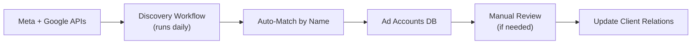

# Notion Database Schemas
## For Weekly Ads Reporting System

---

## Database 1: Clients

This database stores your client list. n8n reads from here to know which clients to run reports for.

### Properties

| Property | Type | Description |
|----------|------|-------------|
| Name | Title | Client company name |
| Status | Select | `Active`, `Paused`, `Churned` |
| Client Code | Text | Unique identifier (e.g., `MEC001`) |
| Meta Ad Account ID | Text | Facebook ad account ID (e.g., `act_123456789`) |
| Google Ads Customer ID | Text | Google Ads customer ID (e.g., `123-456-7890`) |
| GHL Contact ID | Text | GoHighLevel contact ID |
| Stakeholder Emails | Text | Comma-separated emails for report delivery |
| Internal Team Emails | Text | Comma-separated internal emails |
| ROAS Target | Number | Target ROAS for this client |
| Monthly Budget | Number | Monthly ad budget |

### Views

1. **Active Clients** - Filter: Status = Active
2. **All Clients** - No filter, sorted by Name

---

## Database 2: Client Reports

This database stores individual weekly reports per client.

### Properties

| Property | Type | Description |
|----------|------|-------------|
| Name | Title | Auto: `{Client} - Week of {Date}` |
| Client | Relation | Link to Clients database |
| Week | Date | Start of reporting week |
| Spend | Number (Currency) | Total spend for the week |
| Conversions | Number | Total conversions |
| Revenue | Number (Currency) | Total revenue (if tracked) |
| ROAS | Number | Return on ad spend |
| CPA | Number (Currency) | Cost per acquisition |
| CTR | Number (Percent) | Click-through rate |
| WoW ROAS Δ | Number (Percent) | Week-over-week ROAS change |
| WoW CPA Δ | Number (Percent) | Week-over-week CPA change |
| WoW Conversions Δ | Number (Percent) | Week-over-week conversions change |
| Health | Select | `🟢 HEALTHY`, `🟡 WATCH`, `🔴 CRITICAL` |
| PDF Link | URL | Google Drive link to PDF report |
| Has Anomalies | Checkbox | True if issues detected |
| Anomaly Summary | Text | Brief description of issues |
| Top Campaign | Text | Best performing campaign |
| Status | Select | `Generating`, `Delivered`, `Reviewed` |

### Views

1. **This Week** - Filter: Week = This Week
2. **By Client** - Group by Client relation
3. **Declining ROAS** - Filter: WoW ROAS Δ < -10%, Sort: WoW ROAS Δ ascending
4. **CPA Worsening** - Filter: WoW CPA Δ > 20%
5. **Critical Issues** - Filter: Health = 🔴 CRITICAL
6. **Needs Review** - Filter: Status ≠ Reviewed

---

## Database 3: Agency Dashboard

This database stores weekly agency-wide summaries.

### Properties

| Property | Type | Description |
|----------|------|-------------|
| Week | Title | `Week of {Date Range}` |
| Total Spend | Number (Currency) | Sum of all client spend |
| Total Conversions | Number | Sum of all client conversions |
| Total Revenue | Number (Currency) | Sum of all client revenue |
| Avg ROAS | Number | Weighted average ROAS |
| Client Count | Number | Number of active clients |
| Clients Healthy | Number | Count of 🟢 clients |
| Clients Watch | Number | Count of 🟡 clients |
| Clients Critical | Number | Count of 🔴 clients |
| Top Client | Text | Best performer name + ROAS |
| Worst Client | Text | Needs attention name + ROAS |
| Critical Issues | Text | Summary of major problems |
| Anomaly Count | Number | Total anomalies across all clients |

### Views

1. **Latest** - Sort: Week descending, Limit 1
2. **Trend** - Sort: Week ascending (for charts)
3. **Problem Weeks** - Filter: Clients Critical > 0

---

## Database 4: Reporting Issues (Optional)

For logging errors and tracking fixes.

### Properties

| Property | Type | Description |
|----------|------|-------------|
| Name | Title | Auto: `{Client} - {Date} - {Error Type}` |
| Client | Relation | Link to Clients database |
| Date | Date | When issue occurred |
| Error Type | Select | `API Error`, `PDF Failed`, `Email Failed`, `Data Missing` |
| Error Message | Text | Full error details |
| Node | Text | Which n8n node failed |
| Status | Select | `Open`, `Investigating`, `Resolved` |
| Resolution | Text | How it was fixed |

---

## Database 5: Ad Accounts (Auto-Discovered)

This database is **automatically populated** by the Ad Account Discovery workflow. It syncs all Meta and Google ad accounts you have access to and tries to match them to clients.

### Properties

| Property | Type | Description |
|----------|------|-------------|
| Name | Title | Account name from platform |
| Account ID | Text | `act_XXXXXXXXX` (Meta) or `1234567890` (Google) |
| Platform | Select | `Meta`, `Google` |
| Status | Select | `Active`, `Inactive` |
| Client | Relation | Link to Clients database (auto-matched or manual) |
| Match Confidence | Select | `high`, `medium`, `low`, `none` |
| Needs Review | Checkbox | True if auto-match uncertain |
| Inferred Client | Text | What the system guessed the client name is |
| Currency | Text | Account currency (USD, etc.) |
| Total Spent | Number | Lifetime spend (for reference) |
| Last Synced | Date | When last updated by discovery workflow |

### Views

1. **Needs Review** - Filter: Needs Review = ✅, sorted by Last Synced
2. **By Client** - Group by Client relation
3. **Unassigned** - Filter: Client is empty
4. **Meta Accounts** - Filter: Platform = Meta
5. **Google Accounts** - Filter: Platform = Google
6. **All Active** - Filter: Status = Active

### How It Works



1. **Discovery workflow** runs daily at 6 AM
2. Pulls all ad accounts from Meta Business Manager and Google Ads MCC
3. Tries to **auto-match** accounts to clients by name similarity
4. Creates/updates entries in this database
5. Flags accounts that need **manual review** (low confidence matches)
6. Once you assign the Client relation, the weekly report workflow uses it

---

## Environment Variables for n8n

Set these in your n8n instance (Settings → Variables or .env file):

```env
# Notion Database IDs (get from URL when viewing database)
NOTION_CLIENTS_DB_ID=your-clients-db-id
NOTION_REPORTS_DB_ID=your-reports-db-id
NOTION_AGENCY_DB_ID=your-agency-db-id
NOTION_AD_ACCOUNTS_DB_ID=your-ad-accounts-db-id

# Google Drive
GOOGLE_DRIVE_REPORTS_FOLDER_ID=your-folder-id

# Email Recipients
AGENCY_TEAM_EMAILS=jake@agency.com,team@agency.com

# Slack (optional)
SLACK_CHANNEL=#ads-reports
```

---

## Quick Setup Checklist

- [ ] Create "Clients" database in Notion
- [ ] Create "Client Reports" database with relation to Clients
- [ ] Create "Agency Dashboard" database
- [ ] Create "Ad Accounts" database with relation to Clients
- [ ] Get database IDs from Notion URLs
- [ ] Create Google Drive folder for reports
- [ ] Add environment variables to n8n
- [ ] Configure n8n credentials for: Notion, Google, Meta, GHL, Gmail, Slack
- [ ] Import and run Ad Account Discovery workflow first
- [ ] Review and assign any unmatched ad accounts to clients
- [ ] Import and enable Weekly Report workflow
